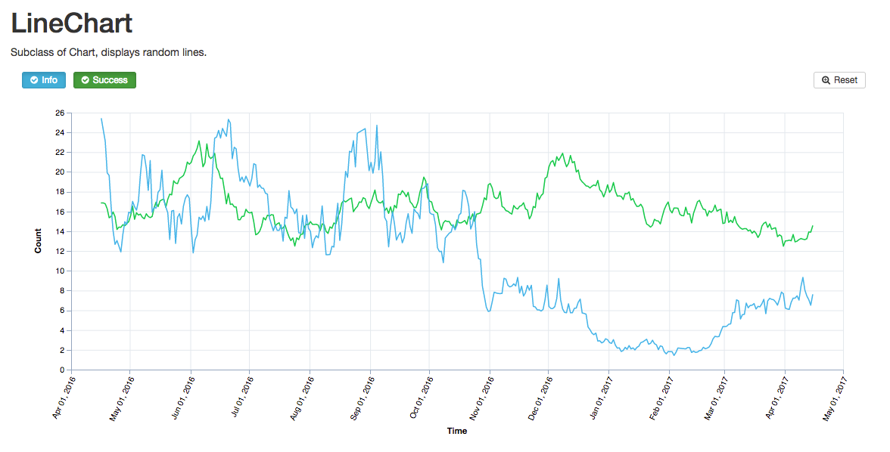

# d3-chart-framework
[](https://circleci.com/gh/dan-nyanko/d3-chart-framework)
[](https://www.npmjs.com/package/d3-chart-framework)

Provides an extensible, reusable approach to building charts with [D3js.org](https://d3js.org/)




## Installation
```

	npm install d3-chart-framework

```


## Examples

See a live example of the react-meteor application on heroku (this may take awhile due to [dyno sleeping](https://devcenter.heroku.com/articles/free-dyno-hours#dyno-sleeping)):

[chart-framework-app](https://chart-framework-app.herokuapp.com/)


### Run Example Meteor Application

To run the meteor example:

```
	git clone git@github.com:dan-nyanko/d3-chart-framework.git
	cd d3-chart-framework/examples/react-meteor/chart-framework-app
	curl https://install.meteor.com/ | sh
	meteor npm install .
	meteor

```

### Example using React with d3-chart-framework
The following code provided an example of rendering a line chart with a tooltip. The tooltip template is a [compiled](https://lodash.com/docs/#template) lodash/underscore template and uses the `<% %>` tags. The chart accepts an options object to define the container ID, optional CSS class, the height of the chart, and setting up the axes.


```jsx

    import React, { Component } from 'react';
    import PropTypes from 'prop-types';
    import Immutable from 'immutable';
    import _ from 'underscore';

    import { LineChart, InvalidNodeError, LineNode, LineGroup } from 'd3-chart-framework';
    //import { LineChart, InvalidNodeError, LineNode, LineGroup } from '../api/build/d3-chart-framework';
    import Toolbar from './Toolbar';


    // tooltip template
    const tmpl = _.template(`
      <p style="padding: 0; font-weight: bold;">
        <%= obj.id %>
      </p>
      <p style="padding: 0;">
        <% if (obj.hasOwnProperty('meta')) { %>
            <%= obj.meta.type %>
        <% } %>
        <i class="fa fa-square"
          <% if (obj.hasOwnProperty('meta')) { %>
            style="color: <%= obj.getFill(obj.meta.type) %>"
          <% } %>
          aria-hidden="true"></i> <%= obj.y1 %>
      </p>
      <p style="padding: 0;">
        <%= new Date(obj.x1).toLocaleDateString() %>
      </p>
    `);

    // options for the chart
    const opts = {
      containerID: 'chart',
      svgContainerClass: 'd3cf-container',
      height: 400,
      axes: {
        useAutoPadding: false,
        grid: true,
        filter: true,
        x: {
          title: 'Time',
          type: 'datetime',
        },
        y: {
          title: 'Count',
          type: 'numeric',
        },
      },
      tooltip: {
        opacity: 1,
        template: tmpl,
      },
      zoom: true,
    };

    export default class LineChartComponent extends Component {
      constructor(props) {
        super(props);
        // initialize the chart state to null
        this.state = {chart: null};
      }

      componentWillUnmount() {
        // when the component unmounts, clean-up the chart by calling the destroy
        // method
        if (this.state.chart) {
          this.state.chart.destroy();
        }
      }

      componentWillReceiveProps(nextProps) {
        if (nextProps.prices !== this.props.prices) {
          this.updateChart(nextProps);
        }
      }

      /*
      * created chart groups based on the list of database `Prices` collection
      *
      * @param {object} chart, an instance of the plot
      * @param {object} price, a database record to convert into a LineNode
      * @return {object} lineNode, an instance of LineNode
      */
      createFromPrices(chart, prices) {
        function getStroke(type) {
          let stroke = '#33B5E5';
          switch (type) {
            case 'warning':
              stroke = '#FFBB33';
              break;
            case 'success':
              stroke = '#00C851';
              break;
            case 'info':
              stroke = '#33B5E5';
              break;
            default:
          }
          return stroke;
        }

        const groups = {};
        prices.forEach((price) => {
          const groupId = `group-${price.type}`;
          let line = groups[groupId];
          const groupOpts = {
            id: groupId,
            s: getStroke(price.type),
            w: 1.5,
            meta: {
              type: price.type,
            },
          };
          const nodeOpts = {
            id: `node-${price._id}`,
            x1: price.x1,
            y1: parseFloat(price.y1),
            o: 0, // opacity
            r: 3, // radius
            meta: {
              type: price.type,
            },
          };
          if (typeof line === 'undefined') {
            groups[groupId] = new LineGroup(chart, groupOpts);
            line = groups[groupId];
            line.addNode(new LineNode(chart, nodeOpts));
          } else {
            line.addNode(new LineNode(chart, nodeOpts));
          }
        });
        return groups;
      }

      updateChart(props) {
        // each time the component receives props (in this case we are expecting
        // the prices List), we will update the chart.
        if (this.state.chart === null || props.prices.size <= 0) {
          return;
        }
        const groups = this.createFromPrices(this.state.chart, props.prices);
        this.state.chart.update(groups);
      }

      componentDidMount() {
        // now that the component has mounted, the div element with id `chart` will
        // exist in the DOM, the LineChart can be constructed.
        this.setState({chart: new LineChart(opts)}, () => {
          this.updateChart(this.props);
        });
      }

      renderToolbar() {
        // the chart cannot be rendered until the DOM element exists; therefore guard
        // agains chart being initialized to null.
        if (this.state.chart === null) {
          return;
        }
        return (<Toolbar chart={this.state.chart} />);
      }

      render() {
        return (
          <div>
            <header>
              <h1>LineChart</h1>
              <p>Subclass of Chart, displays random lines.</p>
            </header>
            { this.renderToolbar() }
            <div id="chart" className="d3cf"></div>
          </div>
        );
      }

    }

    LineChartComponent.propTypes = {
      prices: PropTypes.instanceOf(Immutable.List).isRequired,
    };
```

## Development

To have the /src folder build automatically on file change:

```

	git clone git@github.com:dan-nyanko/d3-chart-framework.git
	cd d3-chart-framework/
	npm install .
	npm run-script watch

```

## API

TODO: build API documentation from [jsDoc3](https://github.com/jsdoc3/jsdoc) and link to this README


## Integration Examples
I have provided an example of using `d3-chart-framework` with meteor and react. This is a very powerful framework combination and is very easy to get working out-of-the-box. However, meteor does require MongoDB and this may or may not work for you. See [react-meteor](examples/react-meteor/)

As an alternative, you may use `webpack`, `browserify`, or even `<script>` tags combined with any server-side framework of your choosing, such as [django](https://www.djangoproject.com/), [ruby on rails](http://rubyonrails.org/), or [hapi](https://hapijs.com/).


## Why use `d3-chart-framework`?
D3js is a powerful library for visualizing data with SVG, Canvas, and HTML. There are many [examples](http://bl.ocks.org/mbostock), but each one is intended for a single use. They are inspiring, but building something that is maintainable usually involves creating a framework, to keep our code extensible and reusable. The concept of reusability has been discussed by others, such as [bocoup.com](https://bocoup.com/weblog/reusability-with-d3) and [bost.ocks.org](https://bost.ocks.org/mike/chart/).

This framework utilizes an object oriented approach, which at its core, promotes breaking code into smaller, isolated classes. As with any programming paradigm, there can always be the chance of 'too much of a good thing' and object oriented programming is no different. Therefore, `d3-chart-framework` has the following goals:

  - Use existing D3js workflow patterns `.enter()` and `.exit()`
  - Its OK to mix functional and object oriented programming
  - Maintain a well-documented API

Hopefully, this answers the why to `d3-chart-framework` and you begin to use it for your own charting visualizations!


## Hows does it work?
The main idea behind `d3-chart-framework` is to create *detached* `Node` class(es), which are an SVG group that are not immediately attached to the DOM. The key word here is *detached*. This simple, yet effective method allows for custom, *reusable*, *extendable* `Node` classes that utilize the D3js [workflow](https://github.com/d3/d3-selection/blob/master/README.md#joining-data).

A `Node` can be any visualization, for example, a single 'circle' SVG element or a more sophisticated group of SVG elements, such as a line segment that contains two circles for the start and end points, connected by a 'line', such as the [SegmentNode.js](src/nodes/SegmentNode.js).

Therefore to utilize `d3-chart-framework`, one only has to create one or more custom nodes and provide them to a Chart or Plot.

To further illustrate this concept, view the example of a [RectNode.js](src/nodes/RectNode.js) that displays a rectangular marker on a `ScatterPlot`.


## Dependencies
TODO: eliminate external dependencies

The current external dependencies are:

  - [underscore](https://github.com/jashkenas/underscore)
  - [moment](https://github.com/moment/moment)
